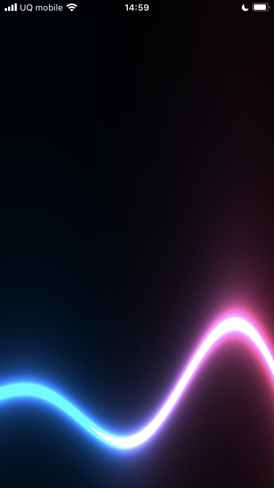

# React glsl template


[](https://github.com/yui0/react-glsl-template/releases)
[](LICENSE)

React Native GLSL Template

You can try this software at the next URL.

https://expo.dev/@yui.nakada/react-glsl-template?serviceType=classic&distribution=expo-go


# Features

* React Native

# How to build

```
#ncu
#ncu -u
yarn
yarn web
make
```

# Screenshots



# ref.

* https://github.com/gre/gl-react

